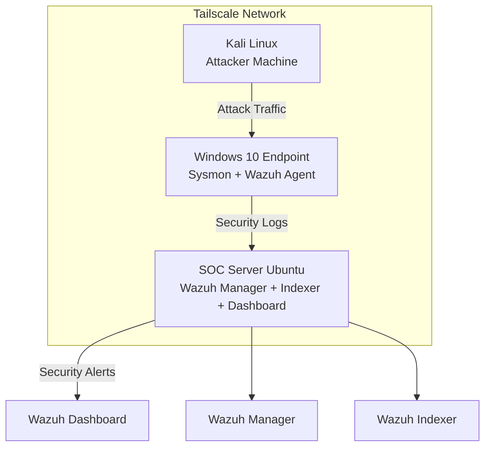

# Sentient Shield SOC-EDR Grid 🛡️

### Security Operations Center (SOC) Monitoring Lab

---

# Project Overview

**Sentient Shield SOC-EDR Grid** is a Security Operations Center (SOC) lab designed to simulate enterprise-level security monitoring and threat detection.

The project uses **Wazuh SIEM**, **Sysmon**, **Atomic Red Team**, and multiple endpoints to monitor system activity, detect attacks, and visualize security events using the **MITRE ATT&CK framework**.

This lab demonstrates how a SOC environment detects malicious activity and responds to threats in real time.

---

# Project Objectives

- Deploy a functional **SOC monitoring infrastructure**
- Collect and analyze logs from multiple endpoints
- Implement **File Integrity Monitoring (FIM)**
- Configure **Active Response mechanisms**
- Simulate real-world cyber attacks
- Map alerts to the **MITRE ATT&CK framework**

---

# Tools and Technologies Used

| Tool | Purpose |
|-----|------|
| Wazuh | SIEM and Endpoint Detection & Response |
| Ubuntu Server | SOC Management Server |
| Windows 10 | Monitored Endpoint |
| Kali Linux | Attack Simulation Machine |
| Sysmon | Windows System Activity Logging |
| Atomic Red Team | Attack Simulation Framework |
| Tailscale | Secure Network Connectivity |
| VirtualBox | Virtualized Lab Environment |

---

# Secure Connectivity with Tailscale

All machines in the SOC lab are connected using **Tailscale**, a secure mesh VPN that creates a private encrypted network between devices.

Tailscale enables secure communication between:

- SOC Server (Ubuntu)
- Windows monitored endpoint
- Kali Linux attacker machine

Benefits of using Tailscale in this project:

- Encrypted communication between all lab systems
- Secure connectivity without exposing services to the public internet
- Simplified networking for virtualized environments
- Reliable peer-to-peer communication between endpoints

---

# SOC Lab Architecture

The SOC environment uses **Tailscale VPN** to securely connect all machines in the monitoring infrastructure.



---

# Week 1 – SOC Infrastructure Setup

## Objective

Deploy the SOC infrastructure and install the Wazuh SIEM platform.

---

## Tasks Completed

- Installed **Wazuh Manager**
- Installed **Wazuh Indexer**
- Installed **Wazuh Dashboard**
- Configured Ubuntu as SOC server
- Installed **Wazuh agents on monitored systems**
- Configured secure connectivity between all machines using **Tailscale VPN**

---

## Wazuh Installation

```bash
curl -sO https://packages.wazuh.com/4.7/wazuh-install.sh
sudo bash wazuh-install.sh -a
```

---

## Dashboard Access

```
https://SOC-SERVER-IP
```

The dashboard provides:

- Security event visualization
- Alert monitoring
- Agent management
- MITRE ATT&CK mapping

---

# Week 2 – Agent Deployment and Log Monitoring

## Objective

Connect endpoints to the SOC server and collect system logs.

---

## Windows Agent Installation

After installing the Wazuh agent on Windows:

```powershell
Get-Service wazuh
```

The agent successfully connected to the SOC server.

---

## Log Monitoring

Wazuh monitored:

- Windows Security logs
- System logs
- Application logs
- File changes
- Authentication events

---

# File Integrity Monitoring

Wazuh File Integrity Monitoring detects unauthorized changes to files.

Example alert:

```
Rule ID: 550
Description: Integrity checksum changed
MITRE Technique: T1565.001
Tactic: Impact
```

This helps detect **data manipulation attacks**.

---

# Week 3 – Active Response Implementation

## Objective

Enable automated responses to security threats.

---

## Active Response Concept

Active Response allows Wazuh to automatically respond when specific rules trigger.

Examples include:

- Blocking attacker IP addresses
- Stopping suspicious processes
- Preventing brute-force attacks

---

## Active Response Configuration

Configuration file:

```
/var/ossec/etc/ossec.conf
```

Example configuration:

```xml
<active-response>
  <command>firewall-drop</command>
  <location>local</location>
  <rules_id>5710</rules_id>
</active-response>
```

---

## Attack Simulation

A brute-force style login attempt was simulated from the Kali attacker machine.

Example command:

```bash
ssh wronguser@SOC-IP
```

---

## Detection Result

Wazuh generated alerts such as:

```
Multiple authentication failures detected
Source IP: Kali attacker machine
Rule ID: 5710
```

Active Response can automatically block the attacker.

---

# Week 4 – Threat Simulation

## Objective

Simulate real cyber attacks using **Atomic Red Team**.

---

## Atomic Red Team Installation

```powershell
Install-AtomicRedTeam -getAtomics
Import-Module C:\AtomicRedTeam\invoke-atomicredteam\Invoke-AtomicRedTeam.psd1
```

---

## Attack Simulation

Technique simulated:

```
MITRE ATT&CK Technique: T1490
Name: Inhibit System Recovery
```

Command executed:

```powershell
Invoke-AtomicTest T1490
```

This triggers:

```
vssadmin delete shadows /all /quiet
```

This command is commonly used by ransomware to prevent system recovery.

---

## Detection Process

```
Atomic Red Team Attack
        ↓
Sysmon logs process execution
        ↓
Wazuh agent sends logs
        ↓
Wazuh manager analyzes logs
        ↓
Alert generated in dashboard
```

---

# MITRE ATT&CK Mapping

Example mapping:

```
Technique: T1490
Tactic: Impact
Description: Inhibit System Recovery
```

This demonstrates Wazuh's ability to map alerts to MITRE ATT&CK techniques.

---

# Results

The SOC lab successfully demonstrated:

- Centralized security monitoring
- Real-time alert detection
- Endpoint monitoring
- File integrity monitoring
- Threat simulation using Atomic Red Team
- MITRE ATT&CK attack mapping

---

# Conclusion

The **Sentient Shield SOC-EDR Grid** project successfully implemented a functional SOC environment capable of detecting suspicious activities and simulated cyber attacks.

This project provided hands-on experience with:

- SIEM deployment
- Endpoint monitoring
- Threat detection
- Attack simulation
- SOC operations

---

# Future Improvements

Possible enhancements include:

- Threat intelligence integration
- Network traffic analysis
- Malware detection
- Automated incident response workflows
- Integration with external security tools

---
